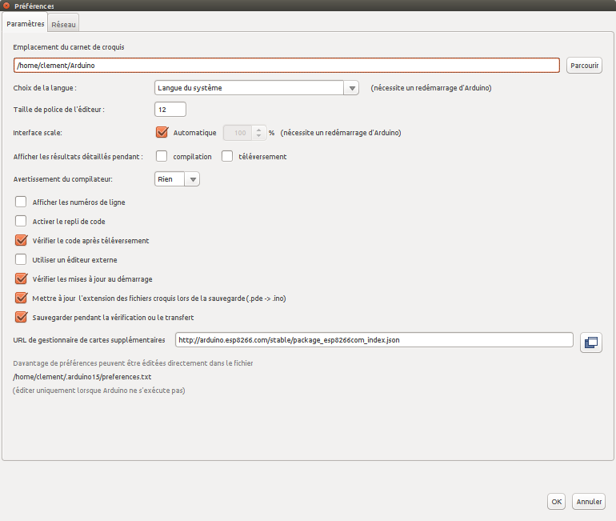
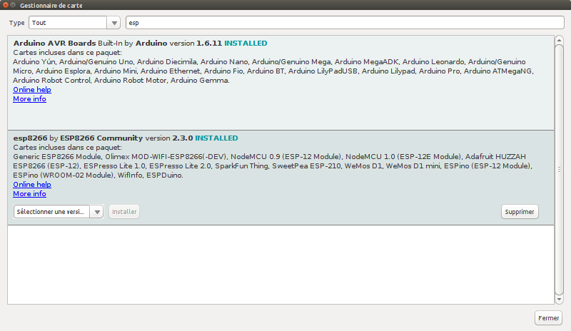
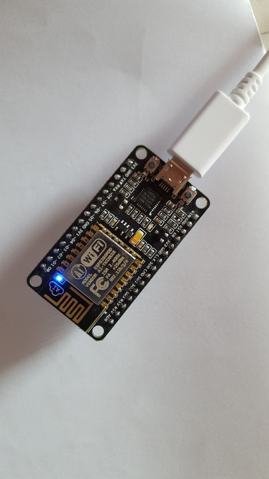
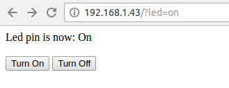
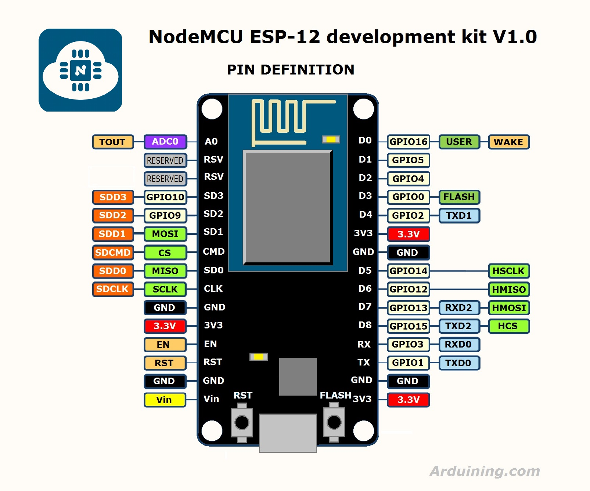

## 1 - Setup ESP8266 board in Arduino IDE

We want the development to be as simple as possible, leveraging Arduino IDE.

Follow this guide to setup ESP8266 board in Arduino IDE: https://github.com/esp8266/Arduino

Documentation is here: http://esp8266.github.io/Arduino/versions/2.3.0/

### Procedure

- Import ESP Board into Arduino IDE




- Load the Libraries for ESP8266




- Load sample _hello_ app into NodeMCU

In Arduino IDE, select proper board, example:
- Tools/Cards/NodeMCU 1.0 board
- CPU 160 MHz
- <correct USB device>

Create sketch such as the [ESP8266 LED](sketches/esp8266-led/esp8266-led.ino)

```js
void setup() {
  // initialize digital pin 2 as an output.
  pinMode(2, OUTPUT);
}


// the loop function runs over and over again forever
void loop() {
  digitalWrite(2, HIGH);   // turn the LED on (HIGH is the voltage level)
  delay(1000);              // wait for a second
  digitalWrite(2, LOW);    // turn the LED off by making the voltage LOW
  delay(1000);              // wait for a second
}
```

LED should blink as shown below:




- Control a Wifi LED

 - Upload sketch found at [ESP8266 LED WIFI](sketches/esp8266-led-wifi/esp8266-led-wifi.ino) with changing Wifi network settings
 - Open Serial Consoleon Arduino IDE
 - Ensure from logs that NodeMCU connected to local Wifi
 - Browse to IP address logged out
 - Click on button to switch led On and Off





### Resources

#### Node MCU Pin Layout

