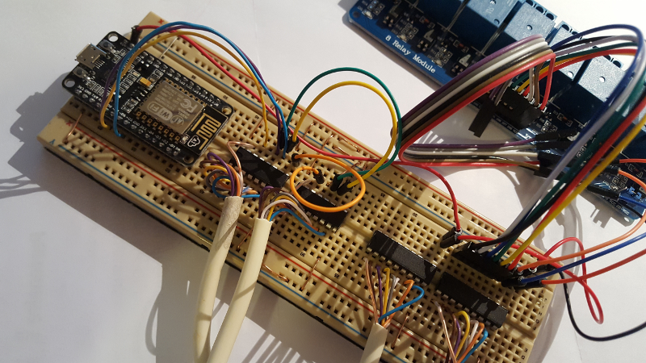
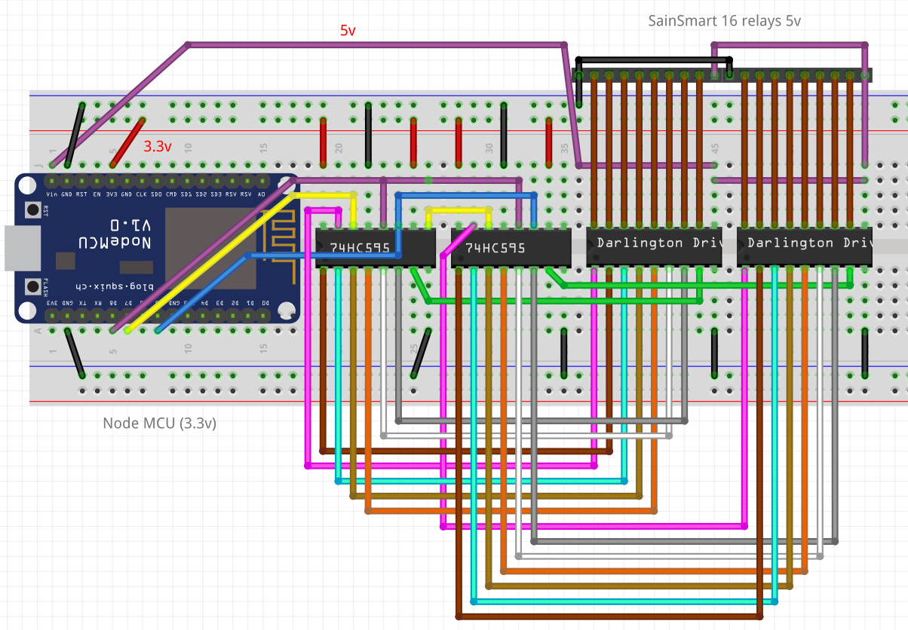
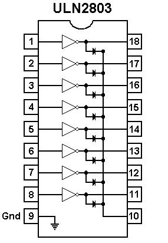

:toc:

== 2 - Breadboard relay board

Using Node MCU for Wifi, there are few remaining constraints:

- GPIOs are 3.3v and we need 5v: *ULN2803* to the rescue
    
    > ULN2803 is a Darlington array which can be used to translate from 3.3v digital outputs to 5v

- Not enough GPIOs: *74HC595* to the rescue
    
    > This components enables use of 3 GPIOs to be used in serial protocol to handle in our case the 16 outputs requires for relay board

Photo (showing wired relay 8 to 15):

Fritzing picture:

=== Procedure

Few more details

==== 74HC595

image:res/74HC595-pins.png[74HC595 pins]

We will use 3 pins from Node MCU:

.wiring 74HC595
[width="80%",cols="3,^2,10",options="header"]
|=========================================================
|NodeMCU |74HC595 |Comment

| gpio13 (D7)   | pin 14        | data
| gpio14 (D5)   | pin 11        | clock (both 74HC595) 
| gpio15 (D8)   | pin 12        | latch (both 74HC595) 

|=========================================================

IMPORTANT: Ground and 3.3v plugged obviously.

IMPORTANT: 1st 74HC595 is connected to 2nd 74HC595 from pin 9 to pin 14.

NOTE: *We now have 16 I/Os through 3 ESP8266 pins!*

==== ULN2803

.wiring ULN2803
[width="80%",cols="3,^2,10",options="header"]
|=========================================================
|74HC595 |ULN2803 |Comment

| 8    | 9         | Ground
| 5v (from power supply)   | 10        | *5v not the 3.3v here!*
| Q0 to Q7   | 1 to 8        | Outputs

|=========================================================

=== Resources

- link:http://www.instructables.com/id/NODEMCU-LUA-ESP8266-With-74HC595-LED-and-Matrix-Dr/step2/ESP8266-driving-dual-595s-with-8-x-8-Matrix/[ESP8266 8x8 matrix]