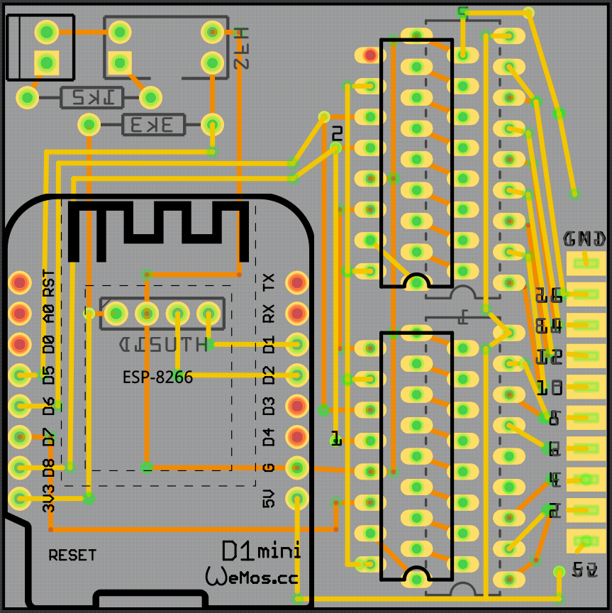

## 6 - PCB based on NodeMCU WeMos

PCB sample can be found under [dist folder](dist)

### PCB - Fritzing

PCB was done using fritzing, the lazy way.

Auto-routing did not work (as usual) so all is routed manually.

