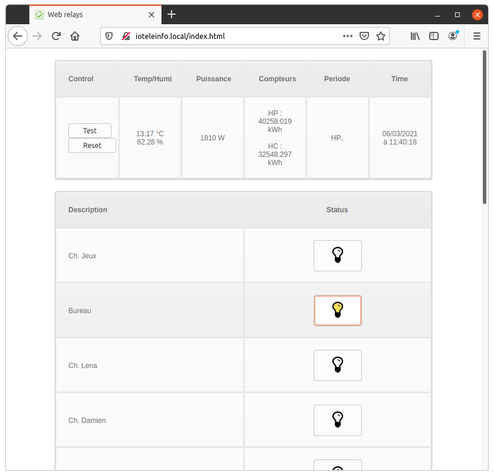

:toc:
:hardbreaks:

[TIP]
====
REST API and websocket API are returning same JSON structure data.

Additionaly, websocket will periodically push changing info such as other user relay switch, Téléinfo and temperature.
====

== API

Below is API description with examples:

=== GET /

Main HTML page display simple button and status:

=== GET /status

[source, json]
----
$ curl http://ioteleinfo.local/status | jq .

{
  "system": {
    "chip-model": "ESP32-D0WDQ6",
    "chip-revision": 1,
    "chip-cores": 2,
    "chip-bluetooth": "/BT/BLE",
    "chip-id": "ABCDEFGH",
    "heap": 256412,
    "flash-size": 4,
    "flash-type": "external",
    "time-iso": "2021-02-06T11:44:37Z"
  },
  "sensors": {
    "temperature": 13.12,
    "humidity": 62.5
  },
  "relays": [
    {
      "description": "Ch. Jeux",
      "id": 0,
      "value": 0
    },
    {
      "description": "Bureau",
      "id": 1,
      "value": 0
    },
    ...
    {
      "description": "Hall",
      "id": 15,
      "value": 0
    }
  ],
  "teleinfo": {
    "ADCO": 3258594758,
    "OPTARIF": "HC..",
    "ISOUSC": 45,
    "HCHC": 32548297,
    "HCHP": 40260054,
    "PTEC": "HP..",
    "IINST": 5,
    "IMAX": 90,
    "PAPP": 1100,
    "HHPHC": "A",
    "MOTDETAT": 0
  },
  "message": "status"
}
----

=== GET /relays/set?id=X&value=Y

Specify id between 0 and 15:

[source, bash]
----
$ curl -v http://ioteleinfo.local/relays/set?id=1&value=-1
{
   "id": 1, "value":0
}
----

TIP: value is 0, 1 or -1 to switch blindly 

=== GET /test

Triggers a cycle on/off on each of the relays, with 500ms in between on/off.
Useful to test the websocket reaction of Web UI.

[source, bash]
----
$ curl -v http://ioteleinfo.local/test
----

== WebSocket

Example at link:/sketches/esp32-10-web-relay-th-teleinfo/data/index.html[index.html]

.Time events (from time to time)
[source, json]
----
{"system":{"time":"1615034255"}}
----

.Teleinfo events (when some field changes)
[source, json]
----
{"teleinfo":{"PAPP":"01140"}}
----

.Temperature events (from time to time)
[source, json]
----
{"sensors":{"temperature":13.2,"humidity":62.75}}
----

.Relays events (when a switch changes)
[source, json]
----
{"relays":[{"id":2,"value":1}]}
----
