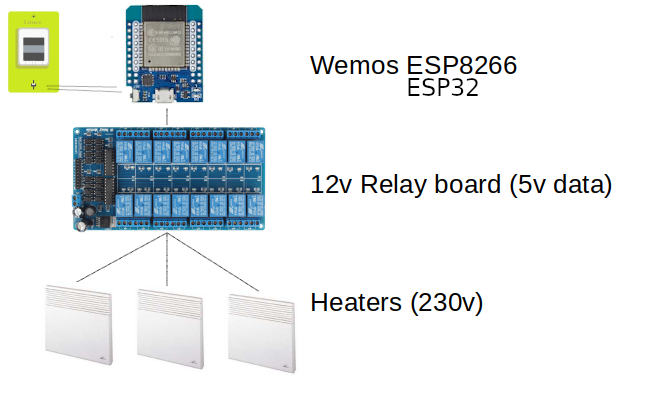

= Web Relay Board
:toc:
:hardbreaks:

ifdef::env-github[]
:imagesdir: /
endif::[]

== Description

This project is an Open Source / Open Hardware minimal approach to build a Web Relay Board.
This Web Relay Board allows to connect 16 devices allowing to switch on/off Main Power.

WARNING: Caution with 230v. Do not use high current.

Check more info in link:http://kalemena.github.io/ti-dhome-web-relay-board/[Details].

