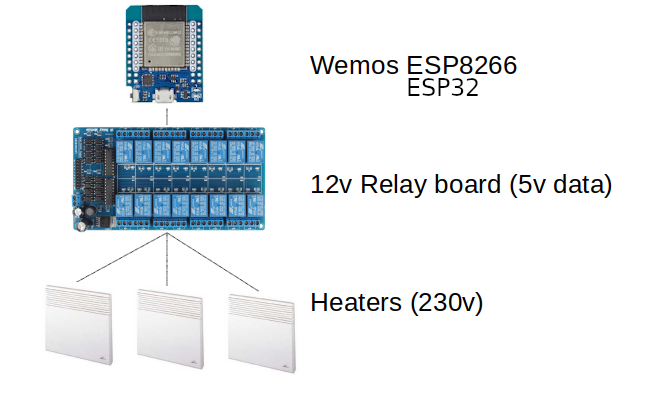

= Web Relay Board

:toc:

== Description

Web Relay Board is a connected IoT which allows to switch Main Power.

WARNING: Caution with 230v. Do not use high current.

The Web Relay board uses HTTP/REST API as interface.

Additionaly, simple Web UI is implemented on top of the REST API.

In practice, the Web Relay is used to manage electric heaters with data wire named link:http://www.planete-domotique.com/blog/2012/01/05/piloter-un-radiateur-grace-a-son-fil-pilote/[fil pilote] which is 230v at very low current.

NOTE: This project is part of a wider link:https://github.com/kalemena/ti-dhome[TiDhome Home Automation] project.

== Specifications

- 16 relays (10 heaters are wired, plus 4 actuators)
- Wifi
- REST API
- Simple web UI

== Prototypes

=== Breadboard #1 sample

image:res/breadboard-video.gif[Breadboard video]

For details on wiring, see link:2-relay-board-prototype.adoc[Iteration 2: Relay Board Prototype]

=== PCB #2 sample

PCB sample details link:dist[here]

image:res/web-relay-board-nodemcu-pcb1.png[PCB Board ESP8266 WeMos,width="40%"]

PCB was printed at link:https://www.dfrobot.com/index.php?route=product/pcb&product_id=1351[DFRobot]

=== Integration in Electric panel

Here is an integration of freshly solder PCB into electric panel:

image:res/web-relay-board-nodemcu-in-place.png[Electric panel Web Relays]

== BOM

Here is list of items to purchase:

.BOM
[width="80%",cols="3,^2,10",options="header"]
|=========================================================
|Component |Price |Comment

|link:http://www.sainsmart.com/relay-1/16-channel-12v-relay-module-for-pic-arm-avr-dsp-arduino-msp430-ttl-logic.html[SainSmart 16 relays] |~ 12€ | 16 relays 12v with 5v data triggers

|link:https://www.amazon.fr/Ferrell-D1-Mini-ESP8266-NodeMcu/dp/B00A3PHBB8/ref=asc_df_B00A3PHBB8[Wemos ESP8266] |~ 4€ | 

|link:http://www.ebay.fr/itm/20-x-74HC595-8-bit-Shift-Register-IC-DIP-16-TEXAS-/260843227719[2x 74HC595] |~ 0.2€ | Shift Register IC DIP-16 Texas (sold by 20)

|link:https://www.ebay.fr/itm/10Pcs-ULN2803A-ULN2803-2803-Transistor-Array-8-NPN-IC-DIP-18-6H/153489654696[2x ULN2803] |~ 0.12€ | (sold by 20)

| *Total* | ~ 20€ |

|=========================================================

= TODO

- more advanced sketch using static file (cached), images, web sockets?, etc
- switch to ESP12 instead of NodeMCU (Wemos)
- create 3D-printed plastic box

= Prototyping iterations

Here are described step by step experiments to reach final product.

- link:1-setup-arduino-ide-for-esp8266.adoc[Iteration 1: Setup ESP8266 board in Arduino IDE]
- link:2-relay-board-prototype.adoc[Iteration 2: Relay Board Prototype]
- link:3-relay-board-sketch.adoc[Iteration 3: Relay Board Sketch]
- link:4-relay-board-sketch-2.adoc[Iteration 4: Relay Board Sketch Advanced]
- link:5-relay-board-esp12e.adoc[Iteration 5: Relay Board ESP12E (aborted)]
- link:6-relay-board-pcb1.adoc[Iteration 6: Relay Board PCB]
