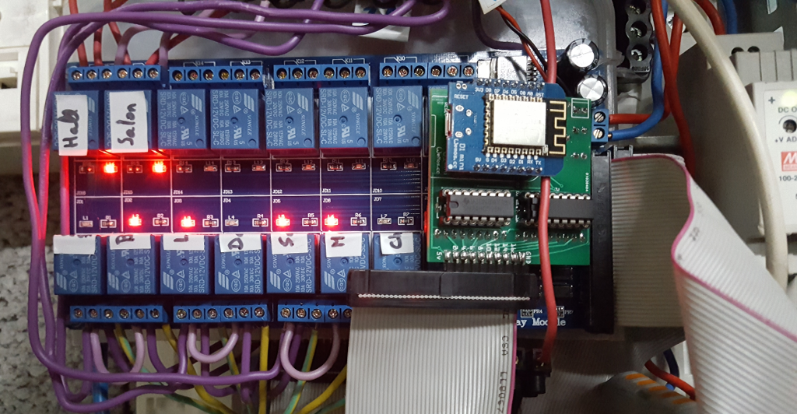

# Web Relay Board

The idea is to create a Web Relay Board.

The relay board can be used to switch Main Power, with caution to not load with high current.

In practice, I use this to manage heaters with data wire named "fil pilote" (that is 230v at very low current).

__Specifications__:
- 16 relays
- REST API
- Wifi

# PCB sample

PCB sample can be found under [dist folder](dist)

# Electric panel

First integration of PCB into electric panel

# BOM

Here is list of items to purchase:

| Component       | Price       | Comment  |
| ------------- |:-------------:|:--------:|
| [SainSmart 16 relays](http://www.sainsmart.com/relay-1/16-channel-12v-relay-module-for-pic-arm-avr-dsp-arduino-msp430-ttl-logic.html)   | ~ 12€        | data     |
| [ESP-12 8266](http://www.ebay.fr/itm/5119-ESP12-E-esp8266-module-wifi-sans-fils-ARDUINO-ESP8266-ESP12E-/191849920712)   | ~ 4€        |   |
| [2x 74HC595](http://www.ebay.fr/itm/20-x-74HC595-8-bit-Shift-Register-IC-DIP-16-TEXAS-/260843227719)   | ~ 0.2€        | sold by 20 |
| [2x ULN2803](http://www.ebay.fr/itm/20x-ULN2803APG-ULN2803-DIP-18-Transistor-TOSHIBA-DARLINGTON-ARRAYS-Buffer-Driver-/350899601550)   | ~ 0.12€       |  sold by 20  |
| __Total__  |  ~ 20€ | |

__Prototyping:__

- Dev Board: [NodeMCU](http://www.ebay.fr/itm/NodeMcu-V3-Lua-WeMos-WiFi-Wireless-Module-CH340-Development-Board-ESP8266-ESP12E-/322164935016) (~ 7€)

__Production:__

- Printed PCB: [Example at DFRobot](https://www.dfrobot.com/index.php?route=product/pcb&product_id=1351) (~ 1€ x 10)

# TODO

- more advanced sketch using static file (cached), images, web sockets?, etc

- switch to ESP12 instead of NodeMCU

- create plastic box

# Prototyping iterations

Here are described step by step experiments to reach final product.

- [01 Setup ESP8266 board in Arduino IDE](1-setup-arduino-ide-for-esp8266.md)

- [02 Relay Board Prototype](2-relay-board-prototype.md)

- [03 Relay Board Sketch](3-relay-board-sketch.md)

- [04 Relay Board Sketch Advanced](4-relay-board-sketch-2.md)

- [05 Relay Board ESP12E](5-relay-board-esp12e.md)

- [06 Relay Board PCB](6-relay-board-pcb1.md)

